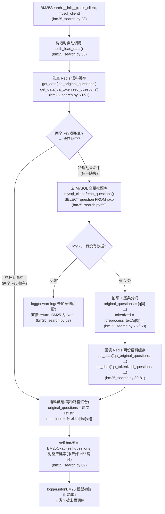
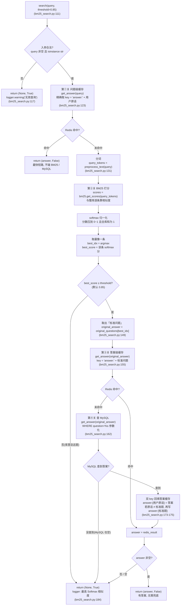

# BM25Search 全链路流程图

> 配套代码:`mysql_qa/retrieval/bm25_search.py`
> 作用对象:`RedisClient`(`cache/redis_client.py`)、`MysqlClient`(`db/mysql_client.py`)、`preprocess_text`(`utils/preprocess.py`)
> 阅读方式:本文件用 Mermaid 画图,VS Code 装 "Mermaid" 插件 或 GitHub 上可直接渲染;不渲染也能看节点文字。

---

## 0. 一句话总览

**一次问答 = 「问题级缓存」最快短路 → 「BM25 相似度检索」归一 → 「答案级缓存」→ 「MySQL 取答案」→ 回填缓存**;
答得出返回 `(answer, False)`,答不出(无效入参 / 分数不达标 / 库里没答案 / 任意异常)一律返回 `(None, True)`,让上层走兜底。

| 返回值 | 含义 |
|---|---|
| `(answer, False)` | 命中,可直接返回给用户 |
| `(None, True)` | 本系统答不了,交给上层兜底(如知识图谱 / 大模型) |

默认阈值 `threshold=0.85`(Softmax 归一化后):相似度 ≥ 0.85 才认为「题库里确实有这题」。

---

## 1. 初始化:题库语料加载 `_load_data()`(冷启动 / 热启动)

`BM25Search` 一被构造就自动加载语料。核心思想:**两个固定 key 装整库语料,先查 Redis,命中直接用;没命中才去 MySQL 拉全库 + 分词,再回填**。

> 关键点:这份语料缓存是**启动即缓存、与有没有人提问无关**,因为 BM25 每次打分都要拿「整库」当候选集。它只在冷启动时建一次,之后启动都走热路径。

---

## 2. 单次问答主流程 `search(query, threshold=0.85)`

用户每次提问走一遍这个流程。

> **异常兜底**:第②~④关(分词 / 打分 / 查库)被外层 `try...except` 罩住(bm25_search.py:186-190)。任一步抛异常 → 记 error 日志 → 同样返回 `(None, True)`,不让进程崩掉。

### 三个可能的出口汇总

| 出口 | 触发条件 | 语义 |
|---|---|---|
| 第①关命中 | 原样问过同样一句话 | 最快,BM25 / MySQL 都不碰 |
| 第②关达标 + 第③④关拿到答案 | 相似度 ≥ 0.85 且查得到 | 常规命中,并回填缓存 |
| 走兜底 `(None, True)` | 入参非法 / 分不达标 / 库里没答案 / 异常 | 交给上层 |

---

## 3. 对照 demo 里的四个查询各走到哪

参照 `bm25_search.py:194` 起测试代码实际跑过的路径:

| 查询 | 类型 | 实际路径 | 返回 |
|---|---|---|---|
| 精确问「用上下文管理器实现函数运行时间的计算?」 | 标准题原样 | ① 缓存未命中 → ② BM25(softmax=1.000)→ ③ 未命中 → ④ MySQL 查到 → 回填 `answer:{标准题}` | `(答案, False)` |
| 近似问「…计算呢」 | 换个说法 | ① 未命中 → ② BM25 归一命中同一条标准题 → ③ 命中第 1 次刚回填的 `answer:{标准题}` → 直接返回 | `(答案, False)` |
| 「今天中午吃什么」 | 库外题 | ① 未命中 → ② BM25 最高分仅 0.047(< 0.85)→ 不查答案直接兜底 | `(None, True)` |
| `''`(空字符串) | 无效入参 | 第 0 步入参校验直接拦截,不进 BM25 | `(None, True)` |

> 注意观察:近似问「计算呢」**没有产生新 key**——它命中的是标准题那条缓存。这正说明「BM25 把千变万化的问法归一到同一条标准问题上」。

---

## 4. 两套缓存对比(核心概念)

| 维度 | `qa_original_questions` / `qa_tokenized_questions` | `answer:{...}` |
|---|---|---|
| 数量 | **固定 2 个**(名字写死) | **随问答增长**(每个命中的新问法加一条) |
| 触发时机 | **启动即缓存**(`_load_data`) | **问过且命中才缓存**(`search` 回填) |
| 粒度 | 整库语料一份 | 一问一 key |
| 存的内容 | 全部问题原文 / 分词结果 | 一个问题 → 一段答案 |
| 谁在用 | 建 BM25 索引(BM25 打分只用内存语料) | 第①关(原话)、第③关(标准题)精确匹配 |
| 会不会自动过期 | 不会(没设 TTL) | 不会(只增不减) |
| 缓存重建 | 冷启动 / Redis 被清时 | 问到没缓存过的新问法时 |

### `answer:` 前缀的作用

- 给「答案缓存」打命名空间标签,避免和语料缓存、其它业务数据**撞 key**;
- 读写双方按**同一条规则**拼 key(`get_answer` 读 `answer:{x}`、命中后写 `answer:{x}`),前缀对得上才能命中;
- 冒号后跟任意原文(可能很长、含中文),只是普通 key 字符串。

### 关键澄清:相似度不查 Redis

BM25 打分(`search` 第②关)是**纯内存**:`用户新问题分词 ↔ 内存里整库标准题分词`,逐条 `get_scores`。Redis 只在第①/③关做**整串精确 key 比对**。所以:

- 相似度永远只跟「题库原题」比,不会拿攒下来的 `answer:{各种问法}` 当候选;
- 不同问法的缓存 key 再多,也只是「原样再来一次」的精确捷径,**不会让两个不同问题变相似**。

---

## 5. 测试入口(`__main__`)一次跑全链路

`python mysql_qa/retrieval/bm25_search.py`(前置:Redis / MySQL 已起、`jpkb` 有数据):

1. 冷启动 `BM25Search` → MySQL 拉 467 题 → 分词 → 回填两份语料 key → 建 BM25;
2. 精确问 / 近似问命中并取到答案;
3. 库外问题、空字符串验证走兜底;
4. 再 `BM25Search` 一次验证**热启动**(语料从 Redis 秒回,不再打印 467 遍「开始预处理数据」);
5. 末尾清理自测产生的 key。

> 说明:打印的「开始预处理数据」是 `preprocess_text()`(utils/preprocess.py:6)里**每处理一条打一条**的日志。冷启动整库分词 → 几百条;每次 `search()` 只分一句 → 一条。若嫌吵,可把该行 `info` 降为 `debug` 或移到批量调用方只打一次。
